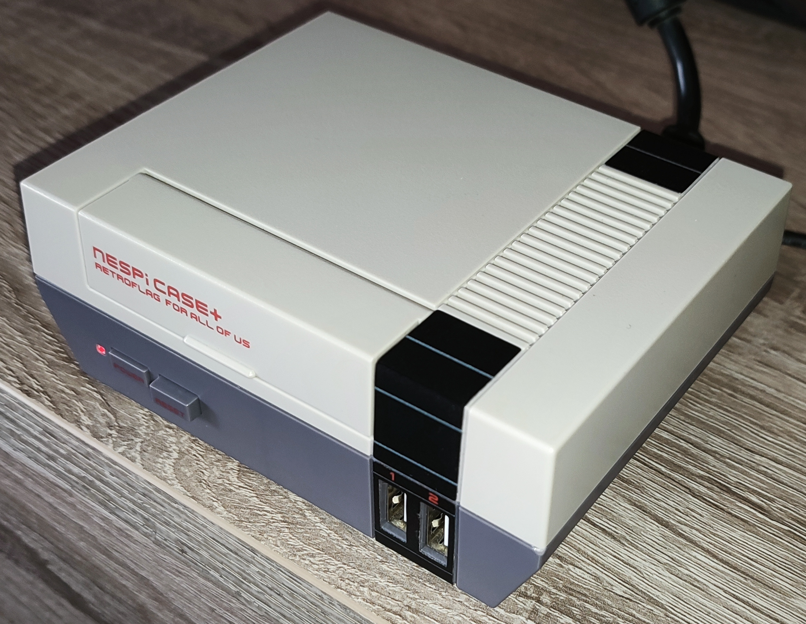
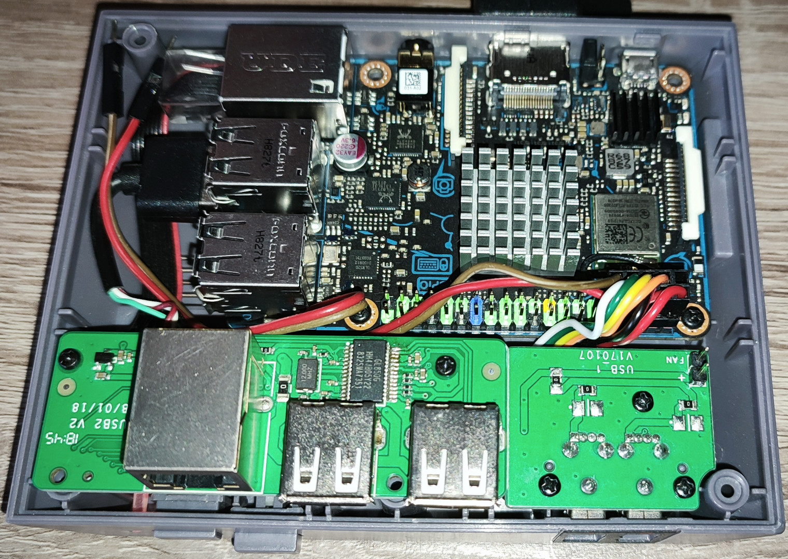

# TinkerELEC Project

This is the documentation of my project to create "[TinkerELEC](https://github.com/s7a7ic/TinkerELEC)" for the **ASUS Tinker Board S** (Rockchip RK3288).
I've reached my goal of having a stable running ELEC[^elec] operating system based on [LibreELEC.tv 12+](https://github.com/LibreELEC/LibreELEC.tv) with [Kodi](https://kodi.tv).

> [!NOTE]
> In this repository you can find additional scripts and configurations to use after the installation of LibreELEC.

## Introduction / About

More info soon...

## Features

**Support for NesPi Case+ Buttons**
- Power Button: wake and "soft shutdown" when delatching
- Reset Button: suspend, wake and reboot (on longpress)
- Power LED control via /sys/class/leds/led-case interface

* Disable internal LEDs via [autostart](scripts/autostart.sh) script

## Notes

* Compilation on Debian 11 (bullseye)

**Why Kodi Version 21.2 (Omega)?**
* Version 22 is not released yet - May 2025
* Better addon compatibility (mostly Jellyfin)

## Pictures

[^elec]: ELEC: **E**mbedded **L**inux **E**ntertainment **C**enter
